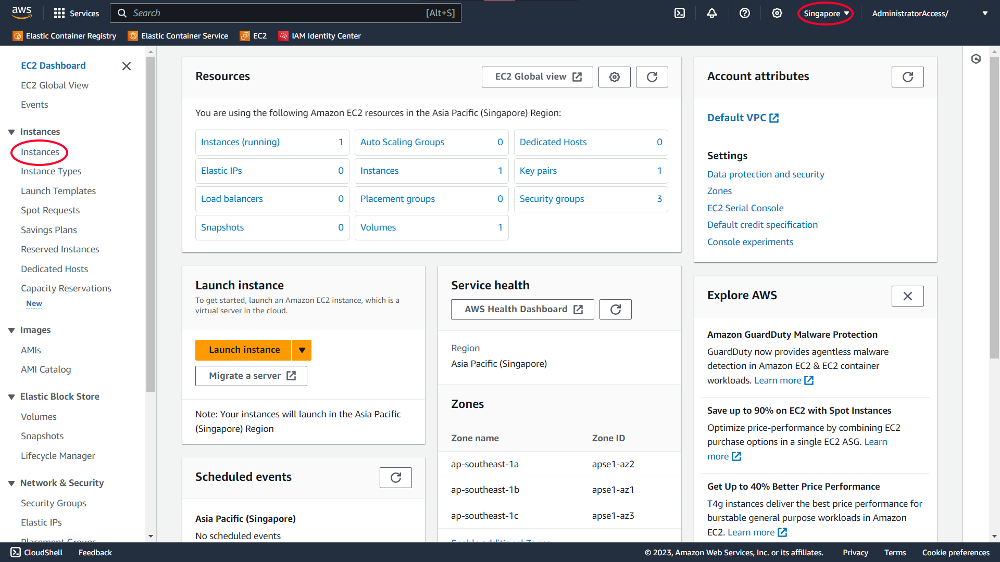
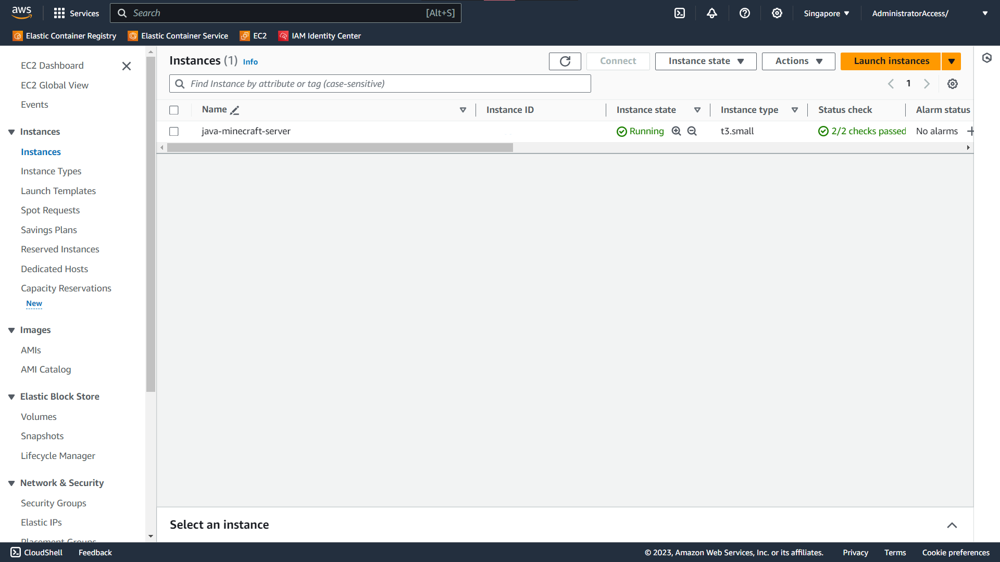
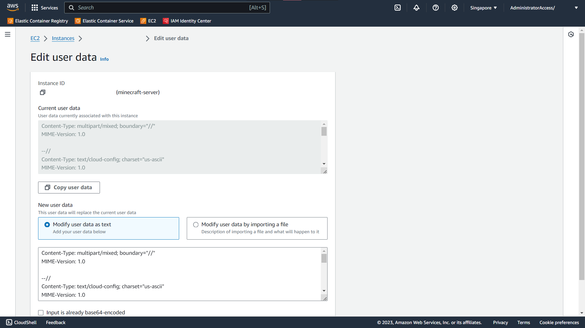

# Automatic Server Start

This is an optional topic that covers the setup to automatically start the minecraft server.

## Edit Instance User Data

Navigate to EC2 in the AWS Console. Make sure you are in the correct region. In the left sidebar, click on "Instances".



Select the Instance and Stop the Instance. After the Instance has been stopped, select the Instance and click on "Actions > Instance Settings > Edit user data".



Select "Modify user data as text" and fill in the user data with the snippet below.

```bash
Content-Type: multipart/mixed; boundary="//"
MIME-Version: 1.0

--//
Content-Type: text/cloud-config; charset="us-ascii"
MIME-Version: 1.0
Content-Transfer-Encoding: 7bit
Content-Disposition: attachment; filename="cloud-config.txt"

#cloud-config
cloud_final_modules:
- [scripts-user, always]

--//
Content-Type: text/x-shellscript; charset="us-ascii"
MIME-Version: 1.0
Content-Transfer-Encoding: 7bit
Content-Disposition: attachment; filename="userdata.txt"

#!/bin/bash
apt-get update
cd ../../opt/minecraft/server
java -Xmx1024M -Xms1024M -jar server.jar nogui
--//--
```

Example user data.



Click the "Save" button on the bottom right.
