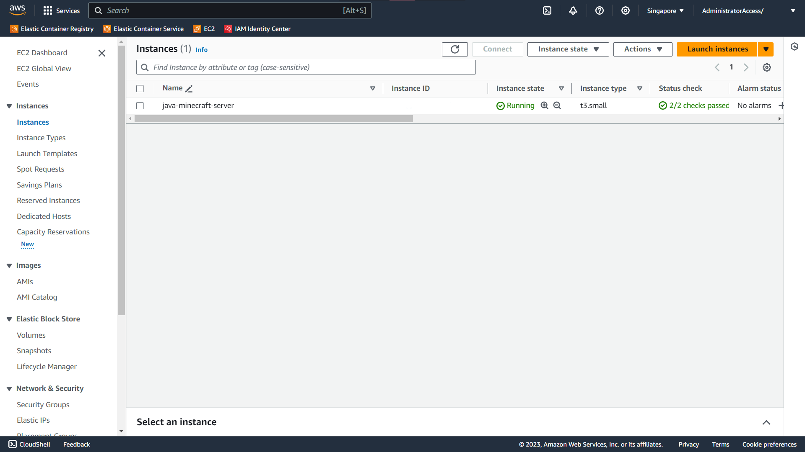

# SSH-ing into the Instance

This topic covers the steps to SSH into your EC2 Instance.

## Obtaining EC2 Instance IP Address

Navigate to EC2 in the AWS Console. Make sure you are in the correct region. In the left sidebar, click on "Instances".


Click on "Instance ID" to open the Instance Summary and Details.



Find and copy the "Public IPv4 address".

## The Command

The command below allows you to ssh into your EC2 Instance.

```bash
ssh -i <path to keypair> ubuntu@<ec2 instance ip address>
```
