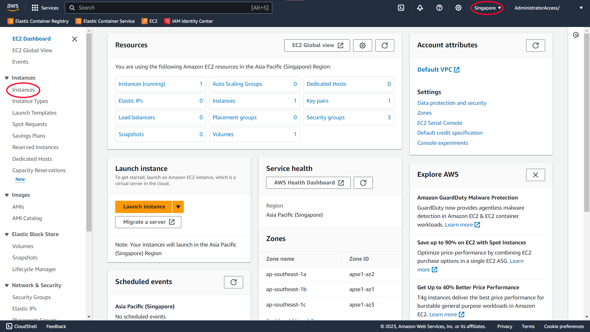

# Setting up EC2

This topic covers the setup of an EC2 instance on AWS.

## Launching an EC2 Instance

Navigate to EC2 in the AWS Console. Make sure you are in the correct region. In the left sidebar, click on "Instances".

Click on the "Launch Instance" button in the top right.

On the "Launch an Instance" page, enter a meaningful name and fill in the rest with the following options.

---

### Application and OS Images (Amazon Machine Image)

#### AMI

Ubuntu Server 20.04 LTS (HVM), SSD Volume Type

#### Architecture

64-bit (x86)

---

### Instance Type

t3.small

---

### Key Pair (Login)

Create a new **RSA** key pair with a **.pem** extension and name it something meaningful. Download the key pair and store it in a safe place. You will need this key pair to SSH into the instance.

#### Key Pair Type

RSA

RSA encrypted private and public key pair

#### Private Key File Format

.pem

---

### Network Settings

Create a new security group. This will be modifed later.

#### Firewall (Security Groups)

Select Allow SSH Traffic From **My IP**

---

### Configure Storage

Leave as default

---

Example Image

Click on the "Launch instance" button to create the instance.

## Note

Once a Key Pair has been created, you will only be allowed to download it once. If the Key Pair file is lost, you will need to recreate and assign the new Key Pair to the instance.
