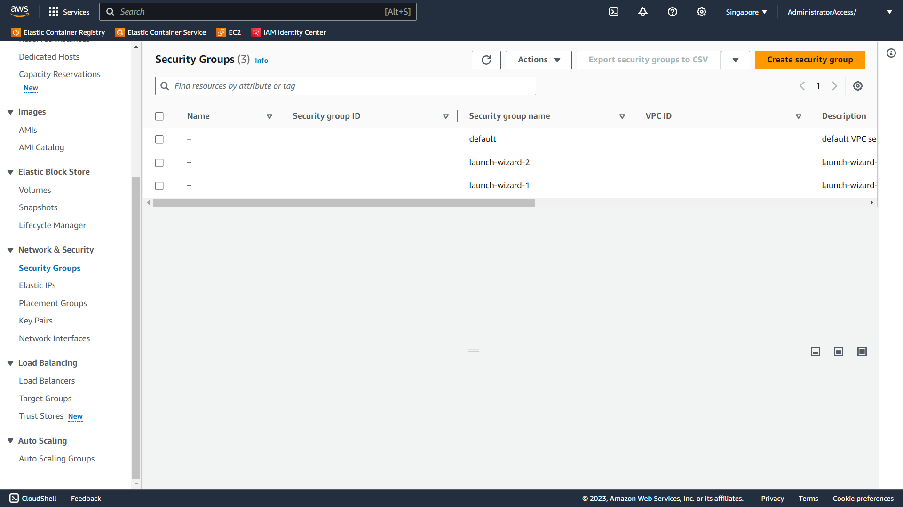
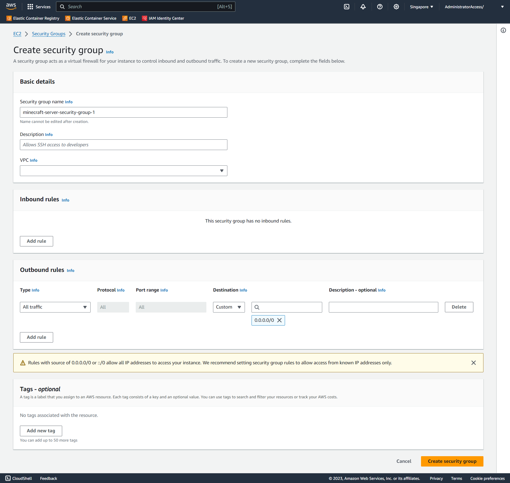
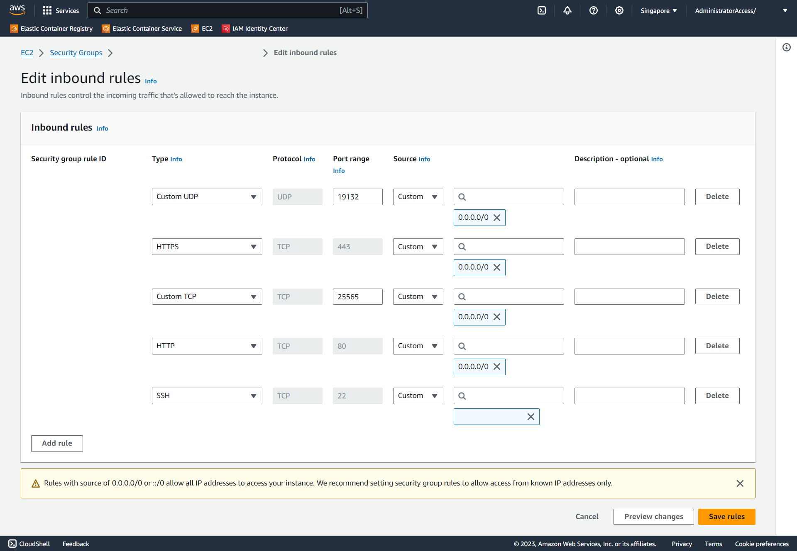

# Setting up Security Groups

This topic covers the setup of a security group for EC2 Instances.

## Creating a new Security Group

If you have a security group created from **Setting up EC2**, skip to **Editing Inbound and Outbound Rules**.

Navigate to EC2 in the AWS Console. Make sure you are in the correct region. In the left sidebar, click on "Security Groups".

In the "Security Groups" page, click on the "Create security group" button on the top right.



On the "Create security group" page, enter a meaningful name and fill in the rest with the following options.

---

### Basic Details

#### VPC

Default

---

### Inbound Rules

Leave as default

---

### Outbound Rules

Leave as default

---

Example Security Group



Click on the "Create security group" button to create the new security group

## Editing Inbound and Outbound Rules

Select the security group created during the EC2 Instance creation or in the previous step by clicking on the "Security Group ID".


Edit the Inbound and Outbound Rules with the following options.

---

### Inbound Rules

This rule allows Minecraft Java Edition players to connect to the server from any IP Address.

```text
Type: Custom UDP
Protocol: UDP
Port Range: 19132
Source: Anywhere-IPv4
```

This rule allows HTTPS requests into the server from any IP Address.

```text
Type: HTTPS
Protocol: TCP
Port Range: 443
Source: Anywhere-IPv4
```

This rule allows Minecraft Bedrock Edition players to connect to the server from any IP Address.

```text
Type: Custom UDP
Protocol: UDP
Port Range: 25565
Source: Anywhere-IPv4
```

This rule allows HTTP requests into the server from any IP Address.

```text
Type: HTTP
Protocol: TCP
Port Range: 80
Source: Anywhere-IPv4
```

This rule allows the you to SSH into the server from your current IP Address.

```text
Type: SSH
Protocol: TCP
Port Range: 22
Source: My IP
```

---

### Outbound Rules

Leave as default

---

Example Inbound Rules



Click on the "Save rules" button on the bottom right to save the rules

## Note

Do **NOT** set the Source for SSH Type to Anywhere-IPv4 as this will allow anyone to SSH from any IP Address into your instance.
