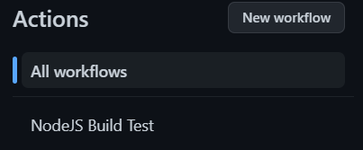

# Workflow Syntax for GitHub Actions

This topic will go through the usually used workflow syntax for GitHub Actions.

## name

The name of the workflow.

GitHub displays the names of your workflows on your repositories "Actions" tab.

If the name is omitted, GitHub sets it to the relative workflow path in your repository.

If the `name` was set to "NodeJS Build Test", this is what it would display:



## run-name

The name for workflow runs generated from the workflow.

GitHub displays the workflow run name in the list of workflow runs on your repositories "Actions" tab.

If `run-name` is omitted or whitespaced, the run name will be set to event-specific information for the run.

If the workflow was triggered by a `pull_request`, it will be set as the commit message.

The value can reference the `github` and `inputs` contexts.

```yaml
run-name: Deploy to ${{ inputs.deploy_target }} by @${{ github.actor }}
```

## on

Use the `on` statement to define which events will automatically trigger the workflow.

Common events that will trigger workflows are:

- issues
- milstone
- project
- pull_requests
- pull_request_review
- push
- release
- schedule
- status
- watch
- workflow_call
- workflow_dispatch
- workflow_run

To use a single event:

```yaml
on: push
```

To use multiple events:

```yaml
on: [push, pulll_request]
```

For filtering, we will use branch filtering as an example:

```yaml
on:
  push:
    branches:
      - main
      - "releases/**"
```

This will only trigger when pushes are made to the `main` branch and all subbranches of the `releases` branch.

## env

A map of environment variables that are available to all the steps of all jobs in the workflow.

```yaml
env:
  SERVER: production
```

## defaults

Creates a map of default settings that will apply to all jobs in the workflow.

You can also set settings that are specific to jobs.

To set the default shell and working directory:

```yaml
defaults:
  run:
    shell: bash
    working-directory: scripts
```

## jobs

A workflow is made up of one or more jobs, which run in parallel by default.

Jobs can also be run sequentially.

Each job runs in a specific environment specified by `runs-on`.

### jobs.<job_id>

Use the above syntax to give your jobs a unique identifier.

The key is a string and its value is a map of the job's configuration data.

The `<job_id>` must start with a letter or `_` and only contain `-`, `_` and alphanumeric characters.

Creating jobs:

```yaml
jobs:
  i_love_ice_cream:
    name: I love ice cream
  i_dropped_my_ice_cream:
    name: I dropped my ice cream
```

### jobs.<job_id>.name

Use the above syntax to set a name for the job.

### jobs.<job_id>.needs

Use the above syntax to identify jobs that must successfully complete before this job will run.

If a job fails, all jobs that need it are skipped unless they use a conditional expression that causes the job to continue.

Requiring successful dependent jobs:

```yaml
jobs:
  job1:
  job2:
    needs: job1
  job3:
    needs: [job1, job2]
```

### jobs.<job_id>.if

Use the above syntax to prevent a job from running unless a condition has been met.

It is possible to use any supported context and expression to create a conditional.

The following example will only run if it is the "Bloggers" repository under user "notlega":

```yaml
name: example-workflow
on: [push]
jobs:
  production-deploy:
    if: github.repository == 'notlega/Bloggers'
    runs-on: ubuntu-latest
    steps:
      - uses: actions/checkout@v3
      - uses: actions/setup-node@v3
        with:
          node-version: '14'
      - run: npm install -g bats
```

### jobs.<job_id>.runs-on

Use the above syntax to define the type of machine to run the job on.

Generally, most jobs will run on the following type of machine:

```yaml
runs-on: ubuntu-latest
```

### jobs.<job_id>.steps

A job contains a sequence of tasks called `steps`.

Steps can run commands, run setup tasks, or run an action in your repository, a public repository, or an action published in a Docker registry

Not all steps run actions, but all actions run as a step.

Changes to environment variables are not preserved between steps.

An example set of steps within a job:

```yaml
name: Greeting from Mona

on: push

jobs:
  my-job:
    name: My Job
    runs-on: ubuntu-latest
    steps:
      - name: Print a greeting
        env:
          MY_VAR: Hi there! My name is
          FIRST_NAME: Mona
          MIDDLE_NAME: The
          LAST_NAME: Octocat
        run: |
          echo $MY_VAR $FIRST_NAME $MIDDLE_NAME $LAST_NAME.
```

### jobs.<job_id>.steps[*].uses

Use the syntax above to select an action to run as part of a step in your job.

An action is a reusable unit of code, much like a function.

You can use an action defined in the same repository as the workflow, a public repository, or in a [published Docker container image](https://hub.docker.com/).

Some actions require inputs that you must set using the `with` keyword.

Using a version action:

```yaml
steps:
  # Reference a specific commit
  - uses: actions/checkout@a81bbbf8298c0fa03ea29cdc473d45769f953675
  # Reference the major version of a release
  - uses: actions/checkout@v3
  # Reference a specific version
  - uses: actions/checkout@v3.2.0
  # Reference a branch
  - uses: actions/checkout@main
```

Using a public action:

```yaml
jobs:
  my_first_job:
    steps:
      - name: My first step
        # Uses the default branch of a public repository
        uses: actions/heroku@main
      - name: My second step
        # Uses a specific version tag of a public repository
        uses: actions/aws@v2.0.1
```

You can specify the action using the following syntax:

```
{owner}/{repo}@{ref}
```

Using an action in the same repository as the workflow:

```yaml
jobs:
  my_first_job:
    steps:
      - name: Check out repository
        uses: actions/checkout@v3
      - name: Use local my-action
        uses: ./.github/actions/my-action
```

You can specify the action using the following syntax:

```
./path/to/dir
```

### jobs.<job_id>.steps[*].run

Use the syntax above to run command-line programs using the operating system's shell.

If a name is not provided, the step name will default to the `run` command.

A single line command should look like:

```yaml
- name: Install Dependencies
  run: npm install
```

A multi-line command should look like:

```yaml
- name: Clean install dependencies and build
  run: |
    npm ci
    npm run build
```

### jobs.<job_id>.steps[*].with

Use the syntax above to specify a map of the input parameters defined by the action.

Each input parameter is a key-value pair.

An example that defines three variables should look something like this:

```yaml
jobs:
  my_first_job:
    steps:
      - name: My first step
        uses: actions/hello_world@main
        with:
          first_name: Mona
          middle_name: The
          last_name: Octocat
```

## Previous Topic

[Creating a basic CI/CD pipeline with GitHub Actions](./Creating_a_basic_CICD_pipeline_with_GitHub_Actions.md)

## Next Topic

[Extra Tips](Extra_Tips.md)
