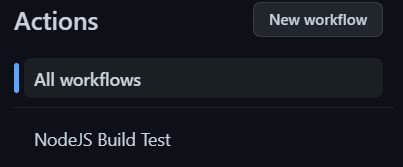

# CI/CD and GitHub Actions

This set of documents will explain on various CI/CD and GitHub Actions related topics.

The numbered points under the table of contents are links that will bring you to the selected page.

To go to the next or previous documentation, scroll to the bottom of the page.

## Table of Contents

1. What is CI/CD
2. What is GitHub Actions
3. Why create a CI/CD pipeline with GitHub Actions
4. Basics of YAML
5. Creating a basic CI/CD pipeline with GitHub Actions
6. Workflow Syntax for GitHub Actions
7. Extra Tips
8. Glossary
9. References/Resources

## What is CI/CD

This topic covers the background and knowledge of CI/CD.

### What is CI

"CI" stands for "Continuous Integration".

Continuous Integration is the automation process of building, testing and merging code changes of an application to a shared repository.

For example, when a developer pushes code to his or her branch on the repository, the pushed code will automatically be built and tested via CI scripts.

This will ensure that the code is able to build properly and run smoothly without any bugs.

Afterwards, the developer can open a pull request, where the code can be automatically merged into the development branch after the CI scripts have been successfully run.

#### History

The term Continuous Integration was first used by [Grady Booch](https://research.ibm.com/people/grady-booch) in 1994 (Karuturi, _An Introduction to Continuous Integration_).

It was used in Booch's book, [_Object-Oriented Analysis and Design with Applications_](https://a.co/d/9GV8wO5) (Sharma, 2018):

“The needs of the micro process dictate that many more internal releases to the development team will be accomplished, with only a few executable releases turned over to external parties.

These internal releases represent a sort of continuous integration of the system, and exist to force closure of the micro process.”

He also writes that testing should “be a continuous activity during the development process”.

Therefore, testing and continuous integration have been interconnected since early on.

Later, in 1997, Kent Beck and Ron Jeffries had brought the concept of Continuous Integration into practice while they were working on Chrysler Comprehensive Compensation System Project (Karuturi, _An Introduction to Continuous Integration_).

### What is CD

"CD" stands for "Continuous Delivery" and/or "Continuous Deployment".

Continuous Delivery ensures that it takes little effort to deliver new code that has been automatically tested and uploaded to the repository.

Basically, it ensures that the software is always ready to be deployed.

Continuous Delivery also requires Continuous Integration.

It relies on similar principles like cutting work into small increments (Sharma, 2018).

Continuous Deployment is similar to Continuous Delivery.

Instead of delivering new code however, it deploys changes from repository to production.

This deployment only occurs when all tests that have been run on the new changes pass successfully.

This new release is usable by customers.

#### History

The concept of Continuous Delivery and Continuous Development came about around 2009 (Jonathan, 2021).

According to authors of the book [Continuous Delivery](https://amzn.to/3o80E15) Jez Humble and Dave Farely, Continuous Delivery and Continuous Development, as a concept, are “in essence the principle of continuous integration [pipelines] taken to its logical conclusion”.

## What is GitHub Actions

GitHub Actions is a CI/CD platform for GitHub.

### What is GitHub

GitHub is a code hosting service for Git repositories.

It provides a web-based graphical interface for users to interact with the repositories.

This is unlike local Git repositories, where the repository is usually interacted through the Command Line.

### What is GitHub Actions

As mentioned above, it is a CI/CD platform provided by GitHub.

It allows for the automation of builds, tests, and deployment pipelines.

GitHub also provides Linux, Windows, and macOS virtual machines to run your workflows.

Prices vary according to the types of VMs being used to run the workflow.

## Why create a CI/CD pipeline with GitHub Actions

GitHub Actions automates most of the manual processes like tests and builds.

GitHub Actions will also perform the actions much faster than performing them manually.

For the examples below, I will be using a NextJS web application.

### Performing the build, tests and hosting manually

When a pull request has been made to the main branch, developers will have to manually build, test and host the application.

To do so, they would have to pull the branch from remote to local and run the commands manually.

This would be slow and inefficient as the time taken for pulling, building, testing and reviewing could have been used for other tasks.

When the pull request is finally accepted and pulled into the develop branch, it would have to be redeployed.

This requires the developer to open the Vercel website, login and reselect the repository that they want to redeploy.

The developer would waste a fair bit of time waiting for the website to load and properly make sure that the application has been deployed successfully.

This will take a fair bit of time that can be reduced by creating a CI/CD pipeline on GitHub Actions to automate deployment.

### Performing the build, tests and hosting using a pipeline

With various CI/CD pipelines using GitHub Actions, we can optimise the developer experience.

When a pull request is made to the main branch, various pipelines for building and testing code will start.

When both build and tests have passed, the pull request will automatically be merged into the main branch.

After the pull request has been merged, the deployment pipeline will start and automatically deploy the application onto Vercel.

The status of the deployment can be seen easily on the home page of the application next to the latest commit message.

This will allow developers to save time and have more time to code instead.

## Basics of YAML

This topic covers the history of the language YAML, as well as the basic syntax to get you started.

### History

YAML stands for "Yet Another Markup Language", which is pretty weird.

It was first proposed by Clark Evans back in 2001.

He went on to design the language together with Ingy döt Net and Oren Ben-Kiki.

It is a data serialisation language often used to create configuration files with any programming language (Sharma, 2022).

YAML is a strict superset of JSON and it was designed for human interaction.

A major difference between YAML and JSON is that newlines and indentations are used in YAML, while JSON uses brackets and braces.

### How to YAML

The basic structure of a YAML file is called a map.

It is written in a key-value pair format from top to bottom.

```yaml
key: value
```

#### Scalar Types

You can use all types of scalar types as values in YAML files.

For example:
- Numbers
- Booleans
- Strings (Quoted or Unquoted)

Words in keys can be separated by underscores.

Generally, people use underscores.

If the value of a key is a multi-line string, you can use the "literal block" style using the "|" character.

This is extremely helpful when writing shell commands.

```yaml
command: |
    if [ "${BRANCH_NAME}" == "main" ];
        then <do something>;
    fi
```

The leading indentation for the multi-line string will be removed.

#### Collection Types

To create collections, use indentations.

```yaml
job:
    build:
        <build script here>
```

If you have a list of items (like docker images), you can denote that sequence using dashes.

```yaml
docker:
    - image: ubuntu:14.04
    - image: mongo:2.6.8
	  command: [mongod, --smallfiles]
    - image: postgres:9.4.1
```

The second item in the sequence has two keys: `image` and `command`.

The `command` key uses a JSON-style sequence because YAML is a superset of JSON.

YAML does not allow tab characters, so have your editor convert them into spaces.

Syntax errors can be an issue, but you can either run the YAML file through an online validator or install linters on your text editors.

## Creating a basic CI/CD pipeline with GitHub Actions

For this example, i'll be using a repository that I own.

[https://github.com/notlega/Bloggers](https://github.com/notlega/Bloggers)

I will be creating a single workflow that only runs when a pull request is made to the `main` branch.

This workflow will test the build of the application only.

### Prerequisites

- A GitHub repository
- Some knowledge of YAML
- Some knowledge of Git

### Choosing a workflow

Open your repository and select the `Actions` tab at the top of your screen.


Under `Continuous integration`, select `Node.js` and configure it.


The current screen should display a pre-written yml file.

### Modifying the workflow

Currently, the following code should be shown on screen.

```yml
# This workflow will do a clean installation of node dependencies, cache/restore them, build the source code and run tests across different versions of node
# For more information see: https://docs.github.com/en/actions/automating-builds-and-tests/building-and-testing-nodejs

name: Node.js CI

on:
  push:
    branches: ["main"]
  pull_request:
    branches: ["main"]

jobs:
  build:
    runs-on: ubuntu-latest

    strategy:
      matrix:
        node-version: [14.x, 16.x, 18.x]
        # See supported Node.js release schedule at https://nodejs.org/en/about/releases/

    steps:
      - uses: actions/checkout@v3
      - name: Use Node.js ${{ matrix.node-version }}
        uses: actions/setup-node@v3
        with:
          node-version: ${{ matrix.node-version }}
          cache: "npm"
      - run: npm ci
      - run: npm run build --if-present
      - run: npm test
```

This workflow basically runs whenever a push or a pull request is made to the `main` branch of the repository.

I will now split this workflow up into several parts to explain it more in depth.

```yml
name: Node.js CI
```

The code block above lets GitHub know what is the name of the workflow.

```yml
on:
  push:
    branches: ["main"]
  pull_request:
    branches: ["main"]
```

The code block above lets GitHub know when to trigger the workflow.

For example, the current workflow will only trigger if a push or a pull request is made to the `main` branch.

If we wanted to modify the workflow to only trigger when a pull request is made, we just need to remove the `push` section of the code block.

Therefore, it should look something like this:

```yml
on:
  pull_request:
    branches: ["main"]
```

The code block above will now only trigger the workflow if a pull request is made to the `main` branch of the repository.

```yml
jobs:
  build:
```

The code block above show a simple example of how to define `jobs`.

A workflow run is made up of one or more `jobs`, and they run in parallel by default.

The `build` is the name of the current job, which will be useful when observing the pipeline graph.

Each job runs in a runner environment specified by `runs-on`:

```yml
runs-on: ubuntu-latest
```

The code block above specifies that the runner environment to use for this job is the latest ubuntu version.

```yml
strategy:
  matrix:
    node-version: [14.x, 16.x, 18.x]
```

The code block above defines a matrix of different job configurations.

A job will run for each possible combination of the variables.

In this case, the job will run three times, once for each node version present within the matrix.

```yml
steps:
  - uses: actions/checkout@v3
  - name: Use Node.js ${{ matrix.node-version }}
    uses: actions/setup-node@v3
    with:
      node-version: ${{ matrix.node-version }}
      cache: "npm"
  - run: npm ci
  - run: npm run build --if-present
  - run: npm test
```

The code block above is the main bulk of the workflow.

`steps` are a sequence of tasks to be carried out.

They can run commands, run setup tasks, run another action within the repository, etc.

`name` is the display name of the step to be displayed on GitHub.

`uses` selects an action to be run as a part of a step in the job.

It is a reusable chunk of code.

The action being used in the code block above is a public action that will help us setup Node with the versions specified in the strategy.

`with` is a map of the input parameters defined by the action.

Each parameter is a key/value pair.

`run` runs command-line programs using the OS's shell.

If a name is not provided, the step name will default to the text specified in the `run` command.

The modified default code should look something like this:

```yml
name: Node.js CI

on:
  pull_request:
    branches: ["main"]

jobs:
  build:
    runs-on: ubuntu-latest

    strategy:
      matrix:
        node-version: [14.x, 16.x, 18.x]

    steps:
      - uses: actions/checkout@v3
      - name: Use Node.js ${{ matrix.node-version }}
        uses: actions/setup-node@v3
        with:
          node-version: ${{ matrix.node-version }}
          cache: "npm"
      - run: npm ci
      - run: npm run build --if-present
```

The above modified code block will now be triggered if a pull request is made to the `main` branch of the repository.

It will test the build of the application only when run.

### Committing the modified workflow

Once the modified code is pasted within the web code editor, click on the `Start commit` button on the top right.

A popup should appear with default configurations.


Click on the `Commit new file` button with the default commit configs if you do not wish to add any custom message or description.

### Testing the workflow

After the commit, merge any branches and test the workflow by creating a pull request to the `main` branch.

A popup should appear at the bottom of the pull request page to run the pipeline.

## Workflow Syntax for GitHub Actions

This topic will go through the usually used workflow syntax for GitHub Actions.

### name

The name of the workflow.

GitHub displays the names of your workflows on your repositories "Actions" tab.

If the name is omitted, GitHub sets it to the relative workflow path in your repository.

If the `name` was set to "NodeJS Build Test", this is what it would display:



### run-name

The name for workflow runs generated from the workflow.

GitHub displays the workflow run name in the list of workflow runs on your repositories "Actions" tab.

If `run-name` is omitted or whitespaced, the run name will be set to event-specific information for the run.

If the workflow was triggered by a `pull_request`, it will be set as the commit message.

The value can reference the `github` and `inputs` contexts.

```yaml
run-name: Deploy to ${{ inputs.deploy_target }} by @${{ github.actor }}
```

### on

Use the `on` statement to define which events will automatically trigger the workflow.

Common events that will trigger workflows are:

- issues
- milstone
- project
- pull_requests
- pull_request_review
- push
- release
- schedule
- status
- watch
- workflow_call
- workflow_dispatch
- workflow_run

To use a single event:

```yaml
on: push
```

To use multiple events:

```yaml
on: [push, pulll_request]
```

For filtering, we will use branch filtering as an example:

```yaml
on:
  push:
    branches:
      - main
      - "releases/**"
```

This will only trigger when pushes are made to the `main` branch and all subbranches of the `releases` branch.

### env

A map of environment variables that are available to all the steps of all jobs in the workflow.

```yaml
env:
  SERVER: production
```

### defaults

Creates a map of default settings that will apply to all jobs in the workflow.

You can also set settings that are specific to jobs.

To set the default shell and working directory:

```yaml
defaults:
  run:
    shell: bash
    working-directory: scripts
```

### jobs

A workflow is made up of one or more jobs, which run in parallel by default.

Jobs can also be run sequentially.

Each job runs in a specific environment specified by `runs-on`.

#### jobs.<job_id>

Use the above syntax to give your jobs a unique identifier.

The key is a string and its value is a map of the job's configuration data.

The `<job_id>` must start with a letter or `_` and only contain `-`, `_` and alphanumeric characters.

Creating jobs:

```yaml
jobs:
  i_love_ice_cream:
    name: I love ice cream
  i_dropped_my_ice_cream:
    name: I dropped my ice cream
```

#### jobs.<job_id>.name

Use the above syntax to set a name for the job.

#### jobs.<job_id>.needs

Use the above syntax to identify jobs that must successfully complete before this job will run.

If a job fails, all jobs that need it are skipped unless they use a conditional expression that causes the job to continue.

Requiring successful dependent jobs:

```yaml
jobs:
  job1:
  job2:
    needs: job1
  job3:
    needs: [job1, job2]
```

#### jobs.<job_id>.if

Use the above syntax to prevent a job from running unless a condition has been met.

It is possible to use any supported context and expression to create a conditional.

The following example will only run if it is the "Bloggers" repository under user "notlega":

```yaml
name: example-workflow
on: [push]
jobs:
  production-deploy:
    if: github.repository == 'notlega/Bloggers'
    runs-on: ubuntu-latest
    steps:
      - uses: actions/checkout@v3
      - uses: actions/setup-node@v3
        with:
          node-version: '14'
      - run: npm install -g bats
```

#### jobs.<job_id>.runs-on

Use the above syntax to define the type of machine to run the job on.

Generally, most jobs will run on the following type of machine:

```yaml
runs-on: ubuntu-latest
```

#### jobs.<job_id>.steps

A job contains a sequence of tasks called `steps`.

Steps can run commands, run setup tasks, or run an action in your repository, a public repository, or an action published in a Docker registry

Not all steps run actions, but all actions run as a step.

Changes to environment variables are not preserved between steps.

An example set of steps within a job:

```yaml
name: Greeting from Mona

on: push

jobs:
  my-job:
    name: My Job
    runs-on: ubuntu-latest
    steps:
      - name: Print a greeting
        env:
          MY_VAR: Hi there! My name is
          FIRST_NAME: Mona
          MIDDLE_NAME: The
          LAST_NAME: Octocat
        run: |
          echo $MY_VAR $FIRST_NAME $MIDDLE_NAME $LAST_NAME.
```

#### jobs.<job_id>.steps[*].uses

Use the syntax above to select an action to run as part of a step in your job.

An action is a reusable unit of code, much like a function.

You can use an action defined in the same repository as the workflow, a public repository, or in a [published Docker container image](https://hub.docker.com/).

Some actions require inputs that you must set using the `with` keyword.

Using a version action:

```yaml
steps:
  # Reference a specific commit
  - uses: actions/checkout@a81bbbf8298c0fa03ea29cdc473d45769f953675
  # Reference the major version of a release
  - uses: actions/checkout@v3
  # Reference a specific version
  - uses: actions/checkout@v3.2.0
  # Reference a branch
  - uses: actions/checkout@main
```

Using a public action:

```yaml
jobs:
  my_first_job:
    steps:
      - name: My first step
        # Uses the default branch of a public repository
        uses: actions/heroku@main
      - name: My second step
        # Uses a specific version tag of a public repository
        uses: actions/aws@v2.0.1
```

You can specify the action using the following syntax:

```
{owner}/{repo}@{ref}
```

Using an action in the same repository as the workflow:

```yaml
jobs:
  my_first_job:
    steps:
      - name: Check out repository
        uses: actions/checkout@v3
      - name: Use local my-action
        uses: ./.github/actions/my-action
```

You can specify the action using the following syntax:

```
./path/to/dir
```

#### jobs.<job_id>.steps[*].run

Use the syntax above to run command-line programs using the operating system's shell.

If a name is not provided, the step name will default to the `run` command.

A single line command should look like:

```yaml
- name: Install Dependencies
  run: npm install
```

A multi-line command should look like:

```yaml
- name: Clean install dependencies and build
  run: |
    npm ci
    npm run build
```

#### jobs.<job_id>.steps[*].with

Use the syntax above to specify a map of the input parameters defined by the action.

Each input parameter is a key-value pair.

An example that defines three variables should look something like this:

```yaml
jobs:
  my_first_job:
    steps:
      - name: My first step
        uses: actions/hello_world@main
        with:
          first_name: Mona
          middle_name: The
          last_name: Octocat
```

## Extra Tips

### Linting

Since this might be the first time learning YAML, syntax errors might be normal occurrences.

Testing YAML files is also quite tough as there is no normal way to debug them.

To solve this issue, a linter can be installed to link the file before submitting it.

If you are using Visual Studio Code, I recommend the YAML extension by Red Hat.


It is also possible to run the code through an online validator such as [https://www.yamllint.com/](https://www.yamllint.com/).

### GitHub Secrets

GitHub Secrets is a place to store encrypted variables.

They can be created in an organisation, repository, or repository environment.

These encrypted variables can be used in workflows instead of saving the values in plaintext format.

For example, environment variables should be stored in GitHub Secrets instead of being stored plaintext inside your repository.

If leaked out, this might cause a lot of trouble.

#### Naming secrets

-   Names can only contain alphanumeric characters (`[a-z]`, `[A-Z]`, `[0-9]`) or underscores (`_`). Spaces are not allowed.
    
-   Names must not start with the `GITHUB_` prefix.
    
-   Names must not start with a number.
    
-   Names are not case-sensitive.
    
-   Names must be unique at the level they are created at.

#### Creating secrets for a repository

1.  On GitHub.com, navigate to the main page of the repository.
2. Under your repository name, click **Settings**.


3. In the "Security" section of the sidebar, select  **Secrets and variables**, then click **Actions**.
4. Click the **Secrets** tab.


5. Click **New repository secret**.
6. Type a name for your secret in the **Name** input box.
7. Enter the value for your secret.
8. Click **Add secret**.

#### Accessing secrets

Access the secrets using the `secrets` context.

```yaml
steps:
  - name: Hello world action
    with: # Set the secret as an input
      super_secret: ${{ secrets.SuperSecret }}
    env: # Or as an environment variable
      super_secret: ${{ secrets.SuperSecret }}
```

### Caching dependencies to speed up workflows

Workflow runs usually reuse the same downloaded dependencies and outputs over multiple runs.

For example, package and dependency management tools such as Maven, Gradle, npm, and Yarn keep a local cache of downloaded dependencies.

To help speed up the time it takes to recreate files like dependencies, GitHub can cache files you frequently use in workflows.

To cache dependencies for a job, you can use GitHub's [`cache` action](https://github.com/actions/cache).

The action creates and restores a cache identified by a unique key.

To use caching, visit [THIS LINK](https://github.com/actions/cache) to learn caching using various languages.

## Glossary

**Git** - An open-source version control software

**GitHub** - A company that offers a cloud-based Git repository hosting service

**Build(s)** - A set of executable code that is ready for customer usage

**Test(s)** - A set of executable code that is used to test code

**Deployment** - Pushing changes and/or updates from one environment to another

**Workflows** - A series of activities that are necessary to complete a task

**CI/CD Pipeline** - A series of automated workflows

## References/Resources

All references have been cited using Harvard referencing.

The references are arranged according to alphabetical order (when possible).

- What is Ci/CD and how does it work? (no date) Synopsys. Synopsys. Available at: [https://www.synopsys.com/glossary/what-is-cicd.html](https://www.synopsys.com/glossary/what-is-cicd.html) (Accessed: January 25, 2023).
- What is CI/CD? (2022) What is CI/CD VB. Red Hat. Available at: [https://www.redhat.com/en/topics/devops/what-is-ci-cd](https://www.redhat.com/en/topics/devops/what-is-ci-cd) (Accessed: January 25, 2023).
- Douglas, B. (2022) How to build a CI/CD pipeline with github actions in four simple steps, The GitHub Blog. GitHub. Available at: [https://github.blog/2022-02-02-build-ci-cd-pipeline-github-actions-four-steps/](https://github.blog/2022-02-02-build-ci-cd-pipeline-github-actions-four-steps/) (Accessed: January 25, 2023).
- Jonathan, H. (2021) _A brief history of CI/CD_, _Jonathan Hall_. Jonathan Hall. Available at: https://jhall.io/archive/2021/09/26/a-brief-history-of-ci/cd/ (Accessed: February 14, 2023).
- Karuturi, S. (no date) _An Introduction to Continuous Integration, Qentelli_. Qentelli. Available at: https://www.qentelli.com/thought-leadership/insights/continuous-integration (Accessed: February 14, 2023).
- Segura, T. (2022) GitHub actions security best practices [cheat sheet included], GitGuardian Blog - Automated Secrets Detection. GitGuardian. Available at: [https://blog.gitguardian.com/github-actions-security-cheat-sheet/](https://blog.gitguardian.com/github-actions-security-cheat-sheet/) (Accessed: January 25, 2023).
- Sharma, A. (2018) _A brief history of DevOps, part III: Automated Testing and Continuous Integration_, _CircleCI_. CircleCI. Available at: https://circleci.com/blog/a-brief-history-of-devops-part-iii-automated-testing-and-continuous-integration/ (Accessed: February 14, 2023).
- Sharma, A. (2020) _A brief history of DevOps, part IV: Continuous delivery vs. continuous deployment_, _CircleCI_. CircleCI. Available at: https://circleci.com/blog/a-brief-history-of-devops-part-iv-continuous-delivery-and-continuous-deployment/ (Accessed: February 14, 2023).
- Sharma, A. (2022) _What is YAML? A beginner's guide_, _CircleCI_. CircleCI. Available at: https://circleci.com/blog/what-is-yaml-a-beginner-s-guide/ (Accessed: February 14, 2023).
